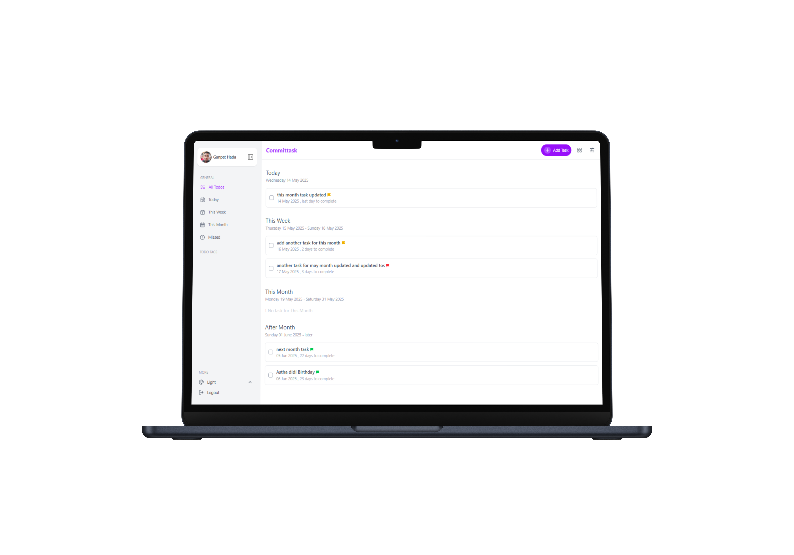
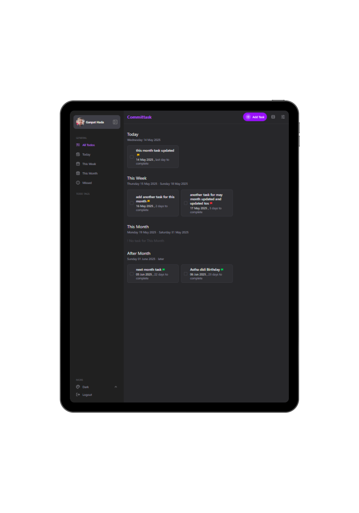
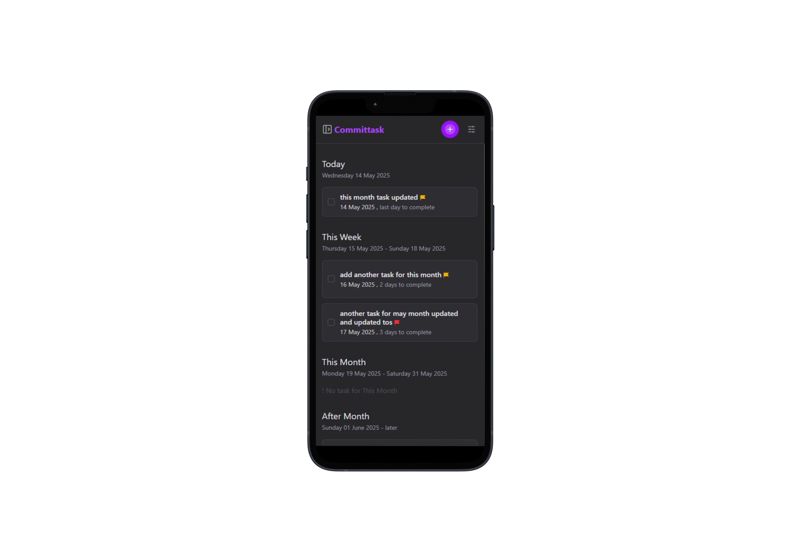

# Committask

CommitTask is a sleek, real-time task management application that helps users create, update, and organize their daily tasks with ease. it features a clean UI, 
allowing users to stay productive and focused.

## Live

[Committask](https://committask.vercel.app)

## 🖼 preview (Desktop/Laptop)

  
  

## 🖼 preview (Tablet)

  

## 🖼 preview (Mobile)

  

## 🚀 Features

- **Task Creation & Editing**: Quickly add, edit, and manage tasks with titles, descriptions, priorities, and due dates.
- **Authentication**: Uses NextAuth both (email based and google-auth) for session persistence.
- **Form Validation**: Ensures all required fields are filled and due dates are not set in the past.
- **Priority & Status Filters**: Sort and filter tasks by priority or completion status for better task organization.
- **User Interface**: Support Themes Fully responsive design that works across desktops, tablets, and mobile devices.
- **Smooth User Experience**: Built with Tailwind CSS to provide clean design and smooth transitions.
- **State Management**: Uses Redux Toolkit to manage task state efficiently across the application.

## 🛠️ Built With

- **Frontend**: Next.js, Redux-toolkit,tailwind
- **Backend**: Next.js,Prisma, NextAuth
- **Database**: PostgreSQL
- **Deployment**: [Vercel](https://vercel.com/)
- **Version Control**: Git, GitHub
